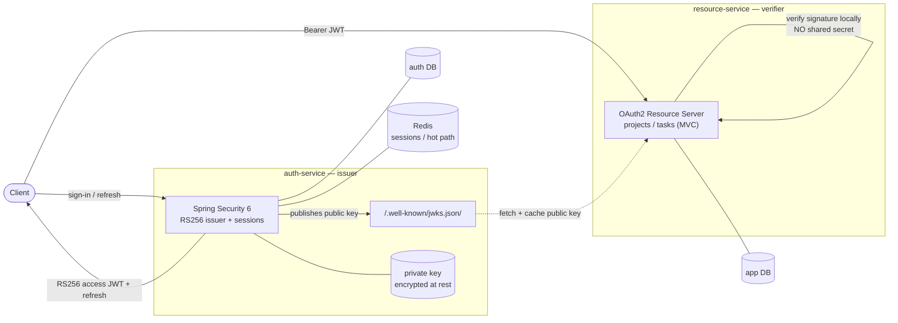

# Hybrid Auth Spring

[](https://github.com/JohnnyCarreiro/hybrid-auth-spring/actions/workflows/ci.yml)
[](https://openjdk.org/projects/jdk/21/)
[](https://spring.io/projects/spring-boot)
[](LICENSE)

> A production-shaped reference for **distributed authentication done correctly in Spring** — a
> dedicated auth-service issues a server-side session **plus** a short-lived RS256 JWT, publishes its
> public key via JWKS, and a separate resource-service verifies those JWTs **locally, with no shared
> secret**.

> [!NOTE]
> **Status: bootstrap.** The Gradle multi-module skeleton, per-service isolated databases, the
> runtime baseline (Jetty + Flyway), and CI are in place and reproducible from a clean checkout. The
> auth flows (sign-up/sign-in, refresh rotation + reuse-detection, JWKS) and the projects/tasks domain
> are **designed and on the roadmap** — see [Roadmap](#roadmap). Nothing below is claimed as shipped
> unless it is in the **Done** column.

## The problem it proves

Most "JWT auth" demos share one symmetric secret between the issuer and every consumer — so any service
that *verifies* a token can also *mint* one. That is the wrong trust boundary. This repo demonstrates
the correct one:

- The **auth-service** owns the private RS256 key and is the *only* thing that can issue tokens.
- It publishes the matching **public** key at `GET /.well-known/jwks.json` (RFC 7517).
- The **resource-service** fetches that public key and verifies signatures **locally** — no shared
  secret, no per-request call back to auth. It can *check* tokens but can never *create* them.

On top of that asymmetry the auth-service runs the hard parts of session management: refresh-token
**rotation** with **reuse-detection** (a replayed refresh token revokes the whole token family). The
design mirrors a hybrid session+JWT / JWKS model the author runs in production on another stack
(better-auth + JWKS), reimplemented idiomatically in Spring Security 6. See
[ADR-0002](docs/hybrid-auth-spring/architecture/adrs/0002-auth-stack-handbuilt-rs256-issuer.md) for why
it is hand-built rather than an off-the-shelf OAuth2 product.

## How it works



- **Asymmetric trust** — private key never leaves auth-service; resource-service holds only the public
  key, so it cannot forge tokens.
- **Hybrid credential** — short-lived RS256 **access JWT** (stateless, locally verifiable) backed by a
  server-side **refresh session** (the revocable source of truth in Postgres, hot-cached in Redis).
- **Refresh rotation + reuse-detection** — every rotation issues a new refresh and invalidates the
  prior one; presenting a rotated/revoked token is detected as reuse and revokes the entire family.
- **Argon2id passwords** — credentials stored only as an Argon2id hash; refresh tokens stored only as a
  SHA-256 hash.
- **Database-per-service isolation** — `auth` and `app` are separate databases with no cross-DB FK or
  query ([ADR-0003](docs/hybrid-auth-spring/architecture/adrs/0003-database-per-service-isolation.md)).

## Stack

Java 21 · Spring Boot 3.5 · Spring Security 6 · **Jetty** · Spring Data JPA + **Flyway** · PostgreSQL ·
Redis · Nimbus JOSE (RS256) · springdoc/OpenAPI · Gradle (Kotlin DSL, multi-module) · JUnit 5 +
**Testcontainers** · Docker Compose.

Two Spring Boot apps and an optional `shared` module:

| Module | Role |
|--------|------|
| [`auth-service`](auth-service/) | Sign-up/in, RS256 JWT issuance, sessions + refresh rotation/reuse-detection, JWKS endpoint. Owns the `auth` DB. |
| [`resource-service`](resource-service/) | MVC task/project manager; validates JWTs via remote JWKS; ownership-based authorization. Owns the `app` DB. |
| `shared` | Cross-module contracts (token claims / DTOs) — introduced only if it earns its keep. |

## Quickstart

```sh
# Full stack (Postgres + Redis + both services), reproducible from a clean checkout:
just docker-up          # or: make docker-up
just health             # both /health -> {"status":"UP"}
just docker-down

# Fast dev loop (host JDK 21 via your toolchain; infra in Docker):
just dev-run            # both services via bootRun (hot reload) + infra
just dev-auth           # one at a time: dev-auth / dev-resource
```

`just` (or `make`) with no target lists every recipe. Ports: `AUTH_PORT=3333`, `RESOURCE_PORT=3334`
(env; `3000` is reserved for a frontend).

## API surface

The designed surface (from the [SRS+SAD](docs/hybrid-auth-spring/architecture/srs+sad.md) §1.4).
Domain routes are **planned** — they land in the capability epics, not bootstrap.

**auth-service**

| Route | Purpose |
|-------|---------|
| `POST /auth/sign-up` | email + password registration (Argon2id) |
| `POST /auth/sign-in` | returns `{ accessToken (RS256 JWT), refreshToken }` |
| `POST /auth/token` | rotate refresh → new access + refresh; reuse → family revoked (401) |
| `POST /auth/sign-out` | revoke current session |
| `GET /me` | current authenticated user |
| `GET /.well-known/jwks.json` | public key set (RFC 7517), cacheable |

**resource-service** (all protected, `Authorization: Bearer <JWT>`)

| Route | Purpose |
|-------|---------|
| `GET\|POST /projects`, `GET\|PUT\|DELETE /projects/{id}` | owner-scoped projects |
| `GET\|POST /projects/{id}/tasks`, `GET\|PUT\|DELETE /tasks/{id}` | owner-scoped tasks |

## Design docs

The architecture is documented and kept in sync with the code under
[`docs/hybrid-auth-spring/`](docs/hybrid-auth-spring/):

- [SRS + SAD](docs/hybrid-auth-spring/architecture/srs+sad.md) — requirements + architecture (combined, small tier).
- [ADRs](docs/hybrid-auth-spring/architecture/adrs/) — locked-in decisions (testing stack, RS256 issuer, db-per-service, runtime baseline).
- [Threat model](docs/hybrid-auth-spring/architecture/threat-model.md) — the system handles credentials and untrusted input.
- [Playbook](docs/hybrid-auth-spring/architecture/playbook/playbook-base.md) — normative engineering conventions.
- [Methodology](docs/hybrid-auth-spring/methodology.md) — how docs and management track each other.

## Roadmap

Capability-first; milestone = release tag. Tracked under
[`docs/hybrid-auth-spring/roadmap/`](docs/hybrid-auth-spring/roadmap/).

| Stage | Scope | Status |
|-------|-------|--------|
| **Bootstrap** (EPIC-001) | Multi-module skeleton, isolated DBs, Jetty + Flyway runtime, CI + format gate | ✅ done → cuts `v0.1.0` |
| **Auth** | Sign-up/in, RS256 issuance, sessions, refresh rotation + reuse-detection, JWKS | ⏳ planned |
| **Resource** | Projects/tasks CRUD, JWT validation via JWKS, ownership authorization | ⏳ planned |
| **Phase 2** | OAuth/social login, RBAC, rate limiting, JWKS rotation with grace window, optional frontend | 🅿️ deferred |

## Contributing / dev setup

```sh
just hooks-install      # wires local git hooks (plain POSIX, no deps): core.hooksPath -> .githooks/
```

- **Branching** (small tier): `feat/<NNN>-<slug>` → merge into `epic/<NNN>-<slug>` → **PR to `dev`**;
  `dev → main` is the release (tagged). `main` and `dev` are protected (PR-only; `main` is no-bypass).
- **Commits**: Conventional Commits. A local `commit-msg` hook checks the format; CI validates the PR
  title (which becomes the squash commit). Formatting is **google-java-format** via Spotless
  (`just fmt` / checked in CI).
- **Releases**: [release-please](https://github.com/googleapis/release-please) cuts versions + the
  CHANGELOG from Conventional Commits when `dev → main` lands.
- CI ([`.github/workflows/ci.yml`](.github/workflows/ci.yml)) runs build + tests (Testcontainers) +
  `spotlessCheck` on every PR.

## License

[MIT](LICENSE) © 2026 Johnny Carreiro.
