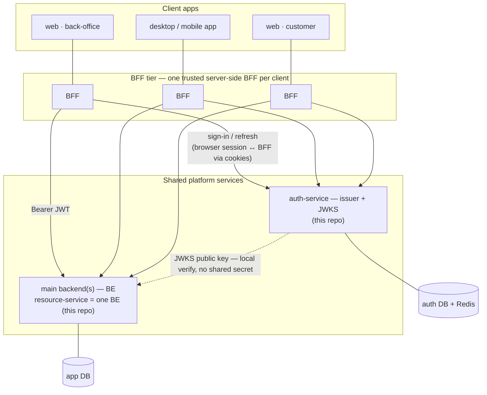

# Hybrid Auth Spring

[](https://github.com/JohnnyCarreiro/hybrid-auth-spring/actions/workflows/ci.yml)
[](https://openjdk.org/projects/jdk/21/)
[](https://spring.io/projects/spring-boot)
[](LICENSE)

> A production-shaped reference for **distributed authentication done correctly in Spring** — a
> dedicated auth-service issues a server-side session **plus** a short-lived RS256 JWT, publishes its
> public key via JWKS, and a separate resource-service verifies those JWTs **locally, with no shared
> secret**.

> [!NOTE]
> **Status: auth shipped (`v0.2.0`); resource built (pending release).** The full auth-service flow —
> sign-up, sign-in, `/me`, refresh rotation + reuse-detection, sign-out, and JWKS — is implemented and
> covered by Testcontainers integration tests. The **resource-service** (projects/tasks CRUD, local JWKS
> verification, ownership authorization, identity mirror) is **built on `epic/003-resource`** and
> validated end-to-end in the full Docker stack; it lands as `v0.3.0` after review. The diagrams and
> route tables mark what is shipped vs deferred.

## The problem it proves

Most "JWT auth" demos share one symmetric secret between the issuer and every consumer — so any service
that *verifies* a token can also *mint* one. That is the wrong trust boundary. This repo demonstrates
the correct one:

- The **auth-service** owns the private RS256 key and is the *only* thing that can issue tokens.
- It publishes the matching **public** key at `GET /.well-known/jwks.json` (RFC 7517).
- The **resource-service** fetches that public key and verifies signatures **locally** — no shared
  secret, no per-request call back to auth. It can *check* tokens but can never *create* them.

On top of that asymmetry the auth-service runs the hard parts of session management: refresh-token
**rotation** with **reuse-detection** (a replayed refresh token revokes the whole token family). The
design mirrors a hybrid session+JWT / JWKS model the author runs in production on another stack
(better-auth + JWKS), reimplemented idiomatically in Spring Security 6. See
[ADR-0002](docs/hybrid-auth-spring/architecture/adrs/0002-auth-stack-handbuilt-rs256-issuer.md) for why
it is hand-built rather than an off-the-shelf OAuth2 product.

## Where this fits

The two services here are the reusable core of a larger, real-world shape: **many client apps, each
behind its own BFF, sharing one identity authority and verifying tokens at every backend.**



**Scenarios this pattern is for:**

- **Multi-client product suites** — a back-office, a customer web app, and a mobile/desktop app that
  must authenticate against **one** identity authority: same accounts and sessions, one place to rotate
  signing keys and revoke a stolen token family.
- **BFF-per-client** — each front-end has its own server-side BFF that holds the browser session
  (HttpOnly cookies), exchanges credentials for short-lived JWTs, and calls the backends on the
  client's behalf. Tokens never live in the browser, so an XSS has a far smaller blast radius.
- **Many backends, stateless verification** — every backend (the `resource-service` is one example BE)
  verifies JWTs **locally** against the auth-service JWKS — no shared secret, no per-request call to
  auth. New backends scale out without touching the issuer.
- **Centralized auth lifecycle** — sign-in, refresh rotation + reuse-detection, sign-out, and
  signing-key rotation live in one service, decoupled from business logic.

**This repo implements the two reusable core pieces** — the **auth-service** (issuer + JWKS) and **one
BE** (the `resource-service`). The client apps and their BFFs are the surrounding context you add per
product; they're out of scope here, but they decide *where the session cookie lives* (the BFF) and
therefore *where CSRF defense belongs*.

> **CSRF.** The auth-service and resource-service are **stateless token APIs**: auth travels in the
> `Authorization: Bearer` header (and the refresh token in the request body), never in an ambient
> session cookie — so a cross-site request can't forge them, and these APIs are CSRF-immune by
> construction (which is why CSRF is disabled in Spring Security here, deliberately). CSRF protection
> belongs at the **BFF ↔ browser edge**, where the session *does* live in a cookie (SameSite cookies +
> an anti-CSRF token). Full analysis in the
> [threat model](docs/hybrid-auth-spring/architecture/threat-model.md#csrf-posture).

## How it works


- **Asymmetric trust** — private key never leaves auth-service; resource-service holds only the public
  key, so it cannot forge tokens.
- **Hybrid credential** — short-lived RS256 **access JWT** (stateless, locally verifiable) backed by a
  server-side **refresh session** (the revocable source of truth in Postgres, hot-cached in Redis).
- **Refresh rotation + reuse-detection** — every rotation issues a new refresh and invalidates the
  prior one; presenting a rotated/revoked token is detected as reuse and revokes the entire family.
- **Argon2id passwords** — credentials stored only as an Argon2id hash; refresh tokens stored only as a
  SHA-256 hash.
- **Database-per-service isolation** — `auth` and `app` are separate databases with no cross-DB FK or
  query ([ADR-0003](docs/hybrid-auth-spring/architecture/adrs/0003-database-per-service-isolation.md)).

## Stack

Java 21 · Spring Boot 3.5 · Spring Security 6 · **Jetty** · Spring Data JPA + **Flyway** · PostgreSQL ·
Redis · Nimbus JOSE (RS256) · Gradle (Kotlin DSL, multi-module) · JUnit 5 + **Testcontainers** · Docker
Compose. *(OpenAPI/Swagger UI and observability — metrics/tracing — are **deferred** for the showcase;
see [API reference](#api-reference) and [ADR-0008](docs/hybrid-auth-spring/architecture/adrs/0008-deferred-operational-surface.md).)*

Two Spring Boot apps and an optional `shared` module:

| Module | Role |
|--------|------|
| [`auth-service`](auth-service/) | Sign-up/in, RS256 JWT issuance, sessions + refresh rotation/reuse-detection, JWKS endpoint. Owns the `auth` DB. |
| [`resource-service`](resource-service/) | MVC task/project manager; validates JWTs via remote JWKS; ownership-based authorization. Owns the `app` DB. |
| `shared` | Cross-module contracts (token claims / DTOs) — introduced only if it earns its keep. |

## Quickstart

```sh
# One-time: the auth-service REQUIRES a JWKS private-key encryption key (it fails fast without one).
cp .env.example .env
echo "AUTH_JWKS_ENC_KEY=$(openssl rand -base64 32)" >> .env   # base64 32-byte AES key; .env is git-ignored

# Full stack (Postgres + Redis + both services), reproducible from a clean checkout:
just docker-up          # or: make docker-up   (compose reads AUTH_JWKS_ENC_KEY from .env)
just health             # both /health -> {"status":"UP"}
just docker-down

# Fast dev loop (host JDK 21 via your toolchain; infra in Docker):
export AUTH_JWKS_ENC_KEY=$(openssl rand -base64 32)   # bootRun reads it from the environment
just dev-run            # both services via bootRun (hot reload) + infra
just dev-auth           # one at a time: dev-auth / dev-resource
```

`just` (or `make`) with no target lists every recipe. Ports: `AUTH_PORT=3333`, `RESOURCE_PORT=3334`
(env; `3000` is reserved for a frontend). The resource-service finds the auth JWKS via
`RESOURCE_AUTH_JWKS_URI` (defaults to the auth-service on `:3333`; set in compose).

## API reference

> [!NOTE]
> This is a **hand-written API reference** standing in for live Swagger UI, which is **deferred** for the
> showcase ([ADR-0008](docs/hybrid-auth-spring/architecture/adrs/0008-deferred-operational-surface.md)).
> In a real deployment **both services would serve OpenAPI/Swagger UI** (dev profile, generated from the
> controllers and the `ProblemDetail` error contract) **and ship observability** — metrics
> (Micrometer/Prometheus), distributed tracing (OpenTelemetry), and structured logs — so this reference
> couldn't drift from the code. Until then, keep it in step with the controllers by hand.

**Conventions**

- **Auth:** routes marked 🔒 require `Authorization: Bearer <access JWT>`. A missing / malformed /
  expired / forged token → **401** (produced by Spring Security's resource-server filter, *not* the
  domain error handler) — applies to every 🔒 route below, so it is omitted from each row.
- **Errors:** RFC 7807 `ProblemDetail` JSON with a stable `code`:
  `{ "type", "title", "status", "detail", "instance", "code" }`. `400 VALIDATION_FAILED` (bean
  validation / unreadable body) applies to every route with a request body.
- **Ids** are UUID v7 strings; **timestamps** are ISO-8601 UTC.

### auth-service — shipped (`:3333`)

| Method · Route | Auth | Request body | Success | Failures (status · `code`) |
|---|---|---|---|---|
| `POST /auth/sign-up` | — | `{ email, password, name? }` | **200** `User` | 409 `EMAIL_ALREADY_TAKEN` · 422 `WEAK_PASSWORD` · 400 `VALIDATION_FAILED` |
| `POST /auth/sign-in` | — | `{ email, password }` | **200** `{ accessToken, refreshToken, user }` | 401 `INVALID_CREDENTIALS` · 400 |
| `POST /auth/token` | — | `{ refreshToken }` | **200** `{ accessToken, refreshToken }` | 401 `INVALID_REFRESH` · 401 `REFRESH_REUSE_DETECTED` · 401 `SESSION_REVOKED` · 401 `SESSION_EXPIRED` |
| `POST /auth/sign-out` | — | `{ refreshToken }` | **204** (no body) | 401 `INVALID_REFRESH` |
| `GET /me` | 🔒 | — | **200** `User` | 401 |
| `GET /.well-known/jwks.json` | — | — | **200** `{ keys: [JWK…] }` (`Cache-Control: public, max-age=600`) | — |
| `GET /health` | — | — | **200** `{ status: "UP" }` | — |

> Notes: **sign-up does *not* return tokens** — it returns the created user only (no auto-login at MVP);
> sign-in is the call that mints the pair. `POST /auth/token` rotates the refresh token (the new one in
> the body); replaying a rotated/revoked refresh revokes the whole session **family** (401
> `REFRESH_REUSE_DETECTED`). The refresh token travels in the **body**, never as a Bearer header.
> Token rotation is a job for the **BFF**, not the resource-service.

### resource-service — built on `epic/003-resource` (`:3334`)

All routes are 🔒 (omitting the implicit 401). Ownership is enforced as **404, not 403** — a project/task
that does not exist *or* is owned by another user is reported identically, so the API never confirms
another user's data. Task ownership is **derived** through the parent project.

| Method · Route | Request body | Success | Failures (status · `code`) |
|---|---|---|---|
| `GET /projects` | — | **200** `Project[]` (owner-scoped) | — |
| `POST /projects` | `{ name, description? }` | **201** `Project` | 400 `VALIDATION_FAILED` |
| `GET /projects/{id}` | — | **200** `Project` | 404 `PROJECT_NOT_FOUND` |
| `PUT /projects/{id}` | `{ name, description? }` | **200** `Project` | 404 `PROJECT_NOT_FOUND` · 400 |
| `DELETE /projects/{id}` | — | **204** (no body) | 404 `PROJECT_NOT_FOUND` |
| `GET /projects/{projectId}/tasks` | — | **200** `Task[]` | 404 `PROJECT_NOT_FOUND` |
| `POST /projects/{projectId}/tasks` | `{ title, description?, status? }` | **201** `Task` | 404 `PROJECT_NOT_FOUND` · 400 |
| `GET /tasks/{id}` | — | **200** `Task` | 404 `TASK_NOT_FOUND` |
| `PUT /tasks/{id}` | `{ title, description?, status? }` | **200** `Task` | 404 `TASK_NOT_FOUND` · 400 |
| `DELETE /tasks/{id}` | — | **204** (no body) | 404 `TASK_NOT_FOUND` |
| `GET /health` | *(public)* | **200** `{ status: "UP" }` | — |

### Schemas

```jsonc
// User (auth-service)
{ "id": "uuid", "email": "string", "name": "string|null", "emailVerified": false, "createdAt": "iso-8601" }

// Project (resource-service)
{ "id": "uuid", "ownerId": "uuid", "name": "string", "description": "string|null",
  "createdAt": "iso-8601", "updatedAt": "iso-8601" }

// Task (resource-service) — status ∈ { TODO, DOING, DONE } (default TODO; unknown value → 400)
{ "id": "uuid", "projectId": "uuid", "title": "string", "description": "string|null",
  "status": "TODO", "createdAt": "iso-8601", "updatedAt": "iso-8601" }

// Error — RFC 7807 ProblemDetail (every non-2xx)
{ "type": "about:blank", "title": "Not Found", "status": 404,
  "detail": "project not found: <id>", "instance": "/projects/<id>", "code": "PROJECT_NOT_FOUND" }
```

Validation: `email` is normalized + format-checked; password policy is 12–200 chars; `name` ≤ 100;
project `name` ≤ 200 and `description` ≤ 2000; task `title` ≤ 200. Manual route tests live in
[`tools/http/`](tools/http/) (auth covered; a resource collection is a follow-up — ADR-0008).

## Design docs

The architecture is documented and kept in sync with the code under
[`docs/hybrid-auth-spring/`](docs/hybrid-auth-spring/):

- [SRS + SAD](docs/hybrid-auth-spring/architecture/srs+sad.md) — requirements + architecture (combined, small tier).
- [ADRs](docs/hybrid-auth-spring/architecture/adrs/) — locked-in decisions (testing stack, RS256 issuer, db-per-service, runtime baseline).
- [Threat model](docs/hybrid-auth-spring/architecture/threat-model.md) — the system handles credentials and untrusted input.
- [Playbook](docs/hybrid-auth-spring/architecture/playbook/playbook-base.md) — normative engineering conventions.
- [Methodology](docs/hybrid-auth-spring/methodology.md) — how docs and management track each other.

## Roadmap

Capability-first; milestone = release tag. Tracked under
[`docs/hybrid-auth-spring/roadmap/`](docs/hybrid-auth-spring/roadmap/).

| Stage | Scope | Status |
|-------|-------|--------|
| **Bootstrap** (EPIC-001) | Multi-module skeleton, isolated DBs, Jetty + Flyway runtime, CI + format gate | ✅ done → cuts `v0.1.0` |
| **Auth** (EPIC-002) | Sign-up/in, RS256 issuance, sessions, refresh rotation + reuse-detection, JWKS | ✅ done → cuts `v0.2.0` |
| **Resource** (EPIC-003) | Projects/tasks CRUD, local JWKS verification (hand-built, [ADR-0005](docs/hybrid-auth-spring/architecture/adrs/0005-resource-server-jwks-verifier.md)), ownership authz, create-only identity mirror | 🔬 built on `epic/003-resource`, validated e2e → cuts `v0.3.0` |
| **Phase 2** | OAuth/social login, RBAC, rate limiting, JWKS rotation with grace window, optional frontend; **event-driven identity sync** ([ADR-0007](docs/hybrid-auth-spring/architecture/adrs/0007-identity-mirror-sync-events.md)); **OpenAPI/Swagger + observability + automated E2E** ([ADR-0008](docs/hybrid-auth-spring/architecture/adrs/0008-deferred-operational-surface.md)) | 🅿️ deferred |

## Contributing / dev setup

```sh
just hooks-install      # wires local git hooks (plain POSIX, no deps): core.hooksPath -> .githooks/
```

- **Branching** (small tier): `feat/<NNN>-<slug>` → merge into `epic/<NNN>-<slug>` → **PR to `dev`**;
  `dev → main` is the release (tagged). `main` and `dev` are protected (PR-only; `main` is no-bypass).
- **Commits**: Conventional Commits. A local `commit-msg` hook checks the format; CI validates the PR
  title (which becomes the squash commit). Formatting is **google-java-format** via Spotless
  (`just fmt` / checked in CI).
- **Releases**: [release-please](https://github.com/googleapis/release-please) cuts versions + the
  CHANGELOG from Conventional Commits when `dev → main` lands.
- CI ([`.github/workflows/ci.yml`](.github/workflows/ci.yml)) runs build + tests (Testcontainers) +
  `spotlessCheck` on every PR.

## License

[MIT](LICENSE) © 2026 Johnny Carreiro.
