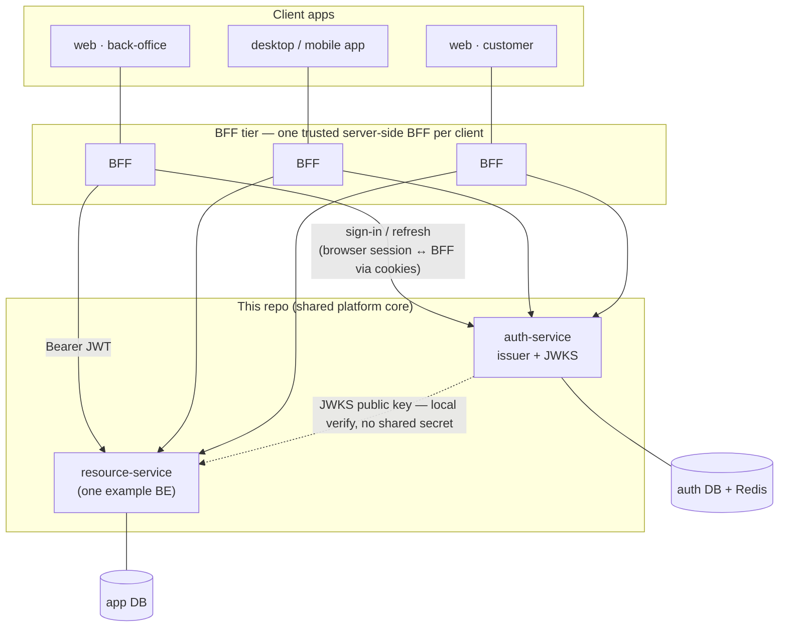
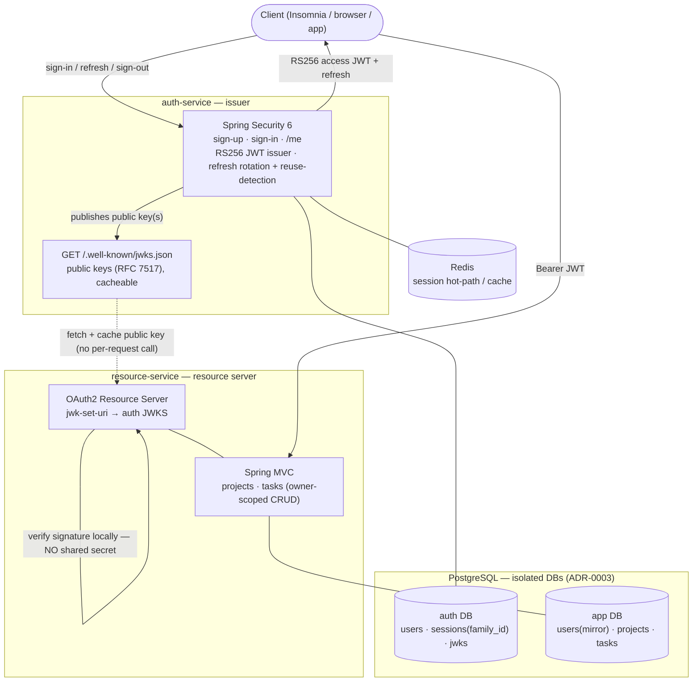
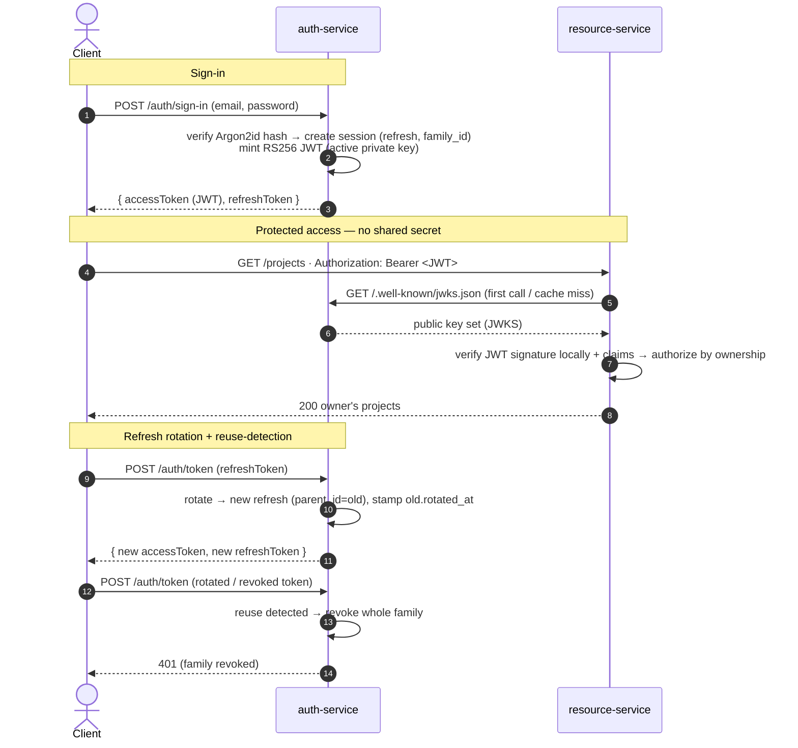

# Hybrid Auth Spring — SRS + SAD (combined)

At `small` tier, requirements (SRS) and architecture (SAD) live in one file. Promote to separate
`srs.md` + `sad.md` when the project graduates to `medium` tier.

## 1. Software Requirements (SRS)

### 1.1 Purpose

Hybrid Auth Spring is a production-shaped reference system that demonstrates **distributed
authentication done correctly in the Spring ecosystem**. A dedicated **auth-service** authenticates
users and issues hybrid credentials — a server-side session (refresh) plus a short-lived, asymmetric
(RS256) JWT access token — and publishes its public signing key through a JWKS endpoint. A separate
**resource-service** (a task/project manager exposed over MVC/CRUD) consumes those access tokens and
**verifies them locally against the JWKS, without ever sharing the signing secret**, authorizing each
request by resource ownership.

The user is a backend/Spring engineer or technical evaluator reading the repository to assess how
the author designs and implements cross-service authentication; and, by extension, anyone who needs a
correct, copyable reference for the hybrid session+JWT / JWKS pattern in Spring. The architecture
mirrors a hybrid-auth model the author designed and runs in production on another stack
(better-auth + JWKS), reimplemented here idiomatically in Spring Security.

### 1.2 Functional requirements

| ID | Requirement | Status |
|----|-------------|--------|
| REQ-001 | A user can sign up with email + password; the password is stored only as a salted hash. | planned |
| REQ-002 | A user can sign in and receive a short-lived RS256 **JWT access token** plus a **refresh token** backed by a server-side session. | planned |
| REQ-003 | A user can rotate the refresh token; each rotation issues a new refresh and invalidates the previous one. | planned |
| REQ-004 | Presenting an already-rotated (or revoked) refresh token is detected as **reuse** and revokes the entire token family. | planned |
| REQ-005 | A user can sign out, revoking the active session. | planned |
| REQ-006 | The auth-service exposes `GET /.well-known/jwks.json` serving the active public key(s) (RFC 7517). | planned |
| REQ-007 | The auth-service exposes `GET /me` returning the current authenticated user. | planned |
| REQ-008 | The resource-service validates incoming JWTs locally against the auth-service JWKS (no shared secret) and rejects missing/invalid/expired tokens. | planned |
| REQ-009 | A user can CRUD **projects** they own. | planned |
| REQ-010 | A user can CRUD **tasks** within a project they own. | planned |
| REQ-011 | Cross-user access to another user's projects/tasks is denied (ownership-based authorization). | planned |
| REQ-012 | Both services publish an OpenAPI/Swagger UI in the dev profile for route inspection. | planned |

### 1.3 Non-functional requirements

- **Security — asymmetric signing.** Access tokens are signed RS256. The resource-service holds only
  the public key (fetched from JWKS); the private key never leaves the auth-service. No shared symmetric secret.
- **Security — short-lived access, server-side refresh.** Access token TTL is short; the refresh
  token is the server-side source of truth (Postgres), cached in Redis. Refresh rotation +
  reuse-detection (token-family revocation). Exact TTLs and key-rotation cadence: see OQ in `open-questions.md`.
- **Security — credential hygiene.** Passwords hashed (BCrypt/Argon2). RS256 dev keys are never committed.
- **Observability (dev).** OpenAPI/Swagger UI on both services; structured logs (playbook §14).
- **Reproducibility.** `docker compose up` brings up the full stack (both services + Postgres + Redis).
- **Testability without a front-end.** All flows exercisable via Insomnia/Postman; auth-critical
  paths covered by integration tests on Testcontainers.

### 1.4 API surface

**auth-service** (HTTP)
- `POST /auth/sign-up` — email + password registration.
- `POST /auth/sign-in` — returns `{ accessToken (JWT, RS256), refreshToken }`.
- `POST /auth/token` — rotate refresh token → new access + refresh; reuse → family revoked (401).
- `POST /auth/sign-out` — revoke current session.
- `GET /me` — current authenticated user.
- `GET /.well-known/jwks.json` — public key set (RFC 7517), cacheable.
- `GET /health` — liveness.

**resource-service** (HTTP, MVC) — all protected, `Authorization: Bearer <JWT>`
- `GET|POST /projects`, `GET|PUT|DELETE /projects/{id}` — owner-scoped.
- `GET|POST /projects/{id}/tasks`, `GET|PUT|DELETE /tasks/{id}` — owner-scoped.
- `GET /health` — liveness.

Routes name domain intentions, not state patches (playbook §6.1).

### 1.5 Out of scope

Front-end UI (bonus only), OAuth/social login, RBAC/roles, rate limiting / account lockout, and
JWKS key rotation with a grace window are **deferred (Phase 2)**. The MVP proves the hybrid auth +
JWKS + ownership-protected CRUD path end-to-end and nothing more.

---

## 2. Software Architecture (SAD)

### 2.1 System context & high-level shape

In a real deployment these two services are **shared platform pieces** behind a fleet of clients, each
fronted by its own BFF. This repo implements the reusable core (the auth-service and one BE); the
clients and BFFs are the surrounding context that shapes the trust boundaries below.



**When to reach for this shape:** multi-client product suites (back-office + customer web + mobile)
that need **one** identity authority; a **BFF-per-client** that keeps the browser session in cookies
and hands short-lived JWTs to the backends (tokens never reach the browser); and **many backends** that
verify JWTs locally via JWKS — no shared secret, no per-request auth call — so new backends scale out
without touching the issuer. Centralizing sign-in, refresh rotation + reuse-detection, sign-out, and
key rotation in one service decouples auth from business logic.

The cookie-bearing edge is the **BFF ↔ browser** boundary; the token-bearing edges (BFF → services,
service → service) carry no ambient credential. That split is exactly why the services here disable
CSRF safely while the BFFs must not — see §2.5 and `threat-model.md`.

Zooming into the core this repo builds:

A **Gradle multi-module monorepo**. Two Spring Boot applications (`auth-service`, `resource-service`)
and an optional `shared` module for cross-cutting contracts. Each service owns an **isolated database**
(`auth` and `app`) on a shared Postgres instance — no cross-database FK or query (ADR-0003); Redis is a
cache / hot-path store for sessions. Everything runs locally via docker-compose.



Repository layout:

```
hybrid-auth-spring/
├── settings.gradle(.kts)        # includes the modules
├── build.gradle(.kts)           # shared plugin/versions config
├── auth-service/                # Spring Boot app — identity & token issuance
├── resource-service/            # Spring Boot app — MVC task/project manager (resource server)
├── shared/                      # (optional) DTOs / JWT claim contracts
├── docker-compose.yml           # Postgres (auth + app DBs) + Redis (+ services)
└── docs/hybrid-auth-spring/     # this docs vault
```

### 2.2 Modules / components

- **auth-service** — owns identity (`users`), credentials, sessions (`sessions`: refresh tokens with
  `family_id` / `parent_id` / `rotated_at` / `revoked_at`), and signing keys (`jwks`: public +
  encrypted private). Issues RS256 JWTs, runs refresh rotation + reuse-detection, serves the JWKS
  endpoint. Spring Security as the identity/authorization-server side. Owns the **`auth`** database (ADR-0003).
- **resource-service** — owns the task/project domain (`projects`, `tasks`, each with an owner).
  Configured as a Spring Security **resource server** whose `jwk-set-uri` points at the auth-service
  `.well-known` endpoint; validates JWT signatures locally and enforces ownership on every operation.
  Owns the **`app`** database; `app.users` mirrors the auth identity by id (no cross-DB FK — ADR-0003).
- **shared** (optional) — JWT claim shapes / DTOs both services agree on. Introduced only if it
  prevents real duplication, not preemptively.

### 2.3 Dependencies

- **Runtime:** Java 21, Spring Boot 3.5, Spring Security 6, Spring Web (MVC), Spring Data JPA/JDBC,
  springdoc-openapi (Swagger UI, dev), a JOSE/JWT library (e.g. Nimbus, via Spring Security), a
  Redis client (Spring Data Redis / Lettuce).
- **Infra:** PostgreSQL (two isolated databases, `auth` + `app` — ADR-0003), Redis, Docker / docker-compose.
- **Build:** Gradle (multi-project).
- **Test:** JUnit 5, Mockito, Testcontainers (Postgres/Redis).

### 2.4 Dataflow

Sign-in then protected access:

```
1. client → auth-service   POST /auth/sign-in (email, password)
2. auth-service            verify hash → create session (refresh, family_id)
                           → mint RS256 JWT (signed with active private key)
                           → { accessToken, refreshToken }
3. client → resource-service  GET /projects   Authorization: Bearer <JWT>
4. resource-service        fetch+cache JWKS from auth-service /.well-known/jwks.json
                           → verify JWT signature locally (public key) + claims
                           → authorize by ownership → return owner's projects
5. (later) client → auth-service  POST /auth/token (refresh)
                           → rotate: new refresh (parent_id=old), stamp old.rotated_at
                           → reuse of a rotated/revoked token ⇒ revoke whole family (401)
```



The resource-service never calls the auth-service per request — it verifies locally with the cached
public key. No shared secret crosses the boundary.

### 2.5 Threat model summary

The asset is user identity and the ability to act as a user. Primary threats: refresh-token theft
(mitigated by rotation + reuse-detection / family revocation), signing-key compromise (private key
encrypted at rest and never exported; only the public side is published), and forged tokens (rejected
by RS256 signature verification against JWKS). Passwords are stored hashed; user enumeration is closed
by a uniform 401 + a decoy-hash timing equalizer on sign-in.

**CSRF** is **not applicable to these services by construction**: they are stateless token APIs (no
server-side auth cookie — the access JWT rides the `Authorization` header, the refresh token rides the
request body), so a cross-site request carries no ambient credential to abuse. Spring Security's CSRF
filter is therefore disabled deliberately, not by omission. CSRF defense belongs at the **BFF ↔ browser
edge** (where a session cookie exists) and is the BFF's responsibility, out of scope here. See
`threat-model.md` for the full table and the CSRF analysis.

### 2.6 Future directions

Phase 2 / bonus, in rough order: a thin front-end; refactor the resource-service toward DDD / clean
architecture; RBAC/roles; rate limiting + account lockout; JWKS key rotation with a publication grace
window; OAuth/social login. None of these change the core boundary established here.

---

## 3. Tactical design

The tactical design lives in flat files `architecture/sdds/sdd-<slug>.md` — one SDD per coherent
domain. Author `sdd-auth` first (the focus), then `sdd-tasks`. At small tier the FRD layer is absorbed
into each SDD's §8 "Functionalities" (intent + acceptance + validation + Tasks). Behavioral routes are
captured in the SDD's behavioral-API-surface table.

See `../sdds/`.
